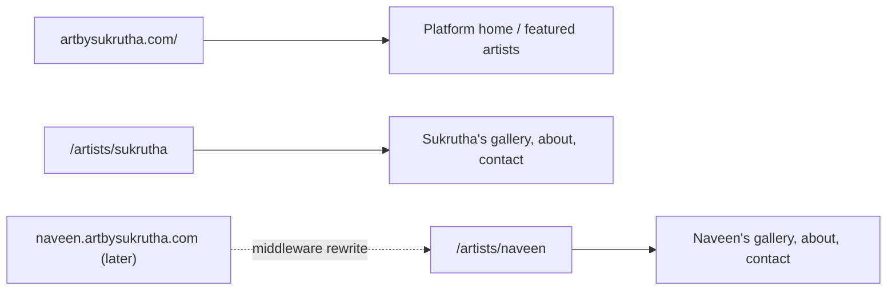
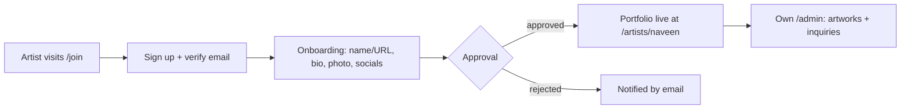

# Roadmap — Art By Sukrutha

This file covers how the site grows from a single-artist portfolio into a multi-artist platform, and how it makes money. For hosting steps, see [DEPLOYMENT.md](DEPLOYMENT.md).

---

## 1. Multi-artist platform

### 1.1 Current state

Today the site serves **one artist**, chosen by `NEXT_PUBLIC_DEFAULT_ARTIST_SLUG`. Changing that value switches the whole site to another artist. It does **not** add a second one.

The data layer is already built for many artists:
- Every artwork and inquiry has an `artist_id`, and artwork slugs only need to be unique per artist.
- `artist_admins` grants admin access per artist.
- Row Level Security lets an artist edit only their own artworks and read only their own inquiries.
- Storage is organised per artist: `artworks/<artist-slug>/<category>/...`.

### 1.2 What exists vs. what's needed

| Area | Already built | Still to build |
|---|---|---|
| **Database** | Every artwork and inquiry has an `artist_id`; About content (journey, inspiration, skills, techniques) and profile photo are per-artist, edited at `/admin/profile` | Per-artist tagline, contact email, theme colour, plan |
| **Security (RLS)** | Artists edit only their own data and read only their own inquiries | Nothing more needed |
| **Storage** | Separate folder per artist | Per-artist limits (e.g. Free = 20 artworks) |
| **Public site** | Hard-wired to one artist through an env var | `/artists/[artist]` routes that resolve the artist from the URL |
| **Admin** | Works for one fixed artist | Resolves the artist from the logged-in user's membership, with an artist switcher if they manage several |
| **Sign-up** | None; users are created by hand in Supabase | Self sign-up, email verification, onboarding wizard |
| **Platform control** | None | Super-admin panel: approve, suspend and feature artists; platform stats |
| **Discovery** | None | "Artists" directory page; later a platform-wide gallery and search |
| **Legal** | Privacy Policy at `/privacy` for a single artist (India's DPDP Act, because buyer details are stored) | Terms of Service, content policy, a platform-wide privacy policy that covers multiple artists |

### 1.3 URL model

- **Start with paths** (`/artists/naveen`).
- **Add subdomains later** using the same code: middleware reads the host and rewrites to `/artists/<slug>`. On Vercel this needs a wildcard domain, `*.artbysukrutha.com`.
- **Custom domains per artist** (e.g. `naveenart.com`) can be added the same way.
- Sukrutha's current URLs (`/gallery`, `/artworks/...`) keep working as aliases.

### 1.4 Artist onboarding flow

### 1.5 Phases

1. **Multi-artist foundation**
   - `/artists/[artist]` routes
   - per-artist branding stored in the database (About content and the profile photo already are, edited at `/admin/profile`)
   - admin tied to the logged-in artist
2. **Invite-only onboarding**
   - you invite an artist by email; they set a password and complete the onboarding wizard
   - safest start: no spam, and you control quality
3. **Super-admin panel**
   - list, approve, suspend and feature artists
   - platform stats
4. **Open sign-up and plans**
   - public `/join` page
   - Free and Pro plans with limits
   - Razorpay subscriptions
5. **Growth**
   - artist directory
   - platform-wide gallery and search
   - subdomains and custom domains

### 1.6 Open decisions

| Decision | Options | Recommended |
|---|---|---|
| Branding | Keep **"Art By Sukrutha"** as the platform name, or use a **neutral platform name** with Sukrutha as the first featured artist | A neutral name, if the goal is many artists |
| Sign-up | Invite-only with approval, or open to anyone | Invite-only first |
| URLs | `/artists/naveen` first, or subdomains from the start | Paths first |
| Root page (`/`) | Sukrutha stays at the root, or a platform page listing artists | Sukrutha at the root until several artists have joined |
| Timing | Launch Sukrutha's site first, or build phase 1 before launch | Launch first, then phases 1–3 |

---

## 2. Monetization

| # | Model | How it works | Best for |
|---|---|---|---|
| 1 | **Direct sales of originals** | Fixed-price works paid online; high-value works stay enquiry-led | Sukrutha, now |
| 2 | **Commissioned paintings** | Enquiry → quote → 30–50% deposit paid online | Sukrutha, now |
| 3 | **Prints and merchandise** | Art prints, postcards and calendars via print-on-demand or a local printer | Recurring income from sold originals |
| 4 | **Digital products** | High-res wallpapers, sketch packs, recorded tutorials | Low effort, no shipping |
| 5 | **Workshops and classes** | Paid online or in-person sessions booked on the site | Artist income and brand building |
| 6 | **Commission per sale** | Platform takes 10–25% of each artist's sale | Multi-artist phase |
| 7 | **Artist subscriptions** | Free tier (limited artworks); Pro tier (unlimited, custom domain, analytics, alerts, lower commission, higher-resolution uploads via the compression presets in `src/lib/image-compression.ts`) | Multi-artist phase |
| 8 | **Featured placement** | Artists pay to appear on the home page or in collections | Once there is traffic |

**Payments:** use **Razorpay** (INR, UPI, cards, netbanking). For the multi-artist phase, **Razorpay Route** splits each payment between the artist and the platform commission.

### 2.1 Alerts as a paid feature

| Feature | Free | Pro (paid) |
|---|---|---|
| Inquiries saved in the dashboard | ✅ | ✅ |
| Email alerts | Daily summary | Instant |
| WhatsApp alerts | — | ✅ Instant, with buyer name, artwork and a reply link |
| Sale tracking and CSV export | Basic | Full, plus analytics |

- **Why email stays free:** it costs almost nothing (Resend's free tier covers about 3,000 emails a month), and free artists still respond to buyers.
- **Why WhatsApp is paid:** Meta charges a fee per message, and artists in India value it most.
- **Suggested price:** about ₹199–₹499 a month, with a yearly discount. Test it with early artists.

**What WhatsApp alerts need:**
- a Meta Business account and a verified sender number (Cloud API directly, or an Indian provider such as Gupshup or Interakt)
- a pre-approved message template
- artist opt-in

**How it fits the code:**
- Add `plan` and `plan_expires_at` on `artists`, and check features with `canUse(artist, "whatsapp_alerts")`.
- Store notification settings per artist: email, WhatsApp number, instant or daily summary.
- Add a notification service with email and WhatsApp senders behind one interface. It runs after an inquiry is saved, so it never blocks the visitor.
- Send the daily summary with Vercel Cron.
- Razorpay subscription webhooks update the plan automatically.

### 2.2 Suggested order

1. **Now (Sukrutha only):**
   - email alerts for new inquiries; do this before promoting the site link on Instagram, because nothing notifies you of new enquiries yet
   - an inquiry pipeline: New → Contacted → Negotiating → Sold / Lost
   - record the sale price and mark the artwork sold
   - CSV export
2. **Next:**
   - Razorpay "Buy now" for fixed-price works
   - commission deposits
   - prints
3. **Multi-artist:**
   - commission tracking
   - automatic payment splits with Razorpay Route
   - subscription plans
   - WhatsApp alerts

---

## 3. Other ideas

- **Site features:** dark mode, blog, exhibitions and events, testimonials, collections.
- **Selling:** certificate of authenticity, downloadable catalogue PDF.
- **Tools and integrations:** AI-assisted descriptions, Etsy and Instagram integrations, newsletter.
